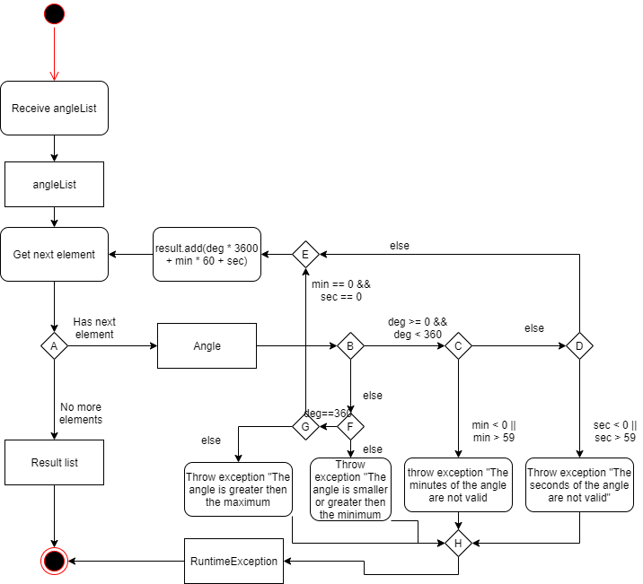
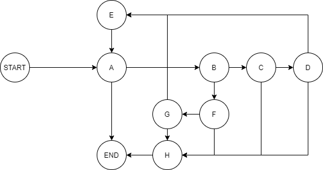
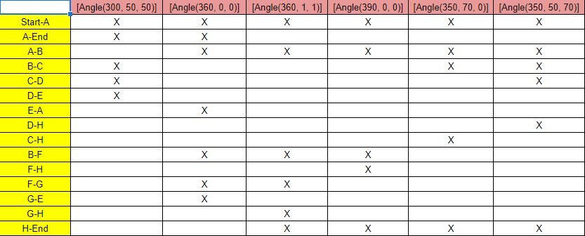
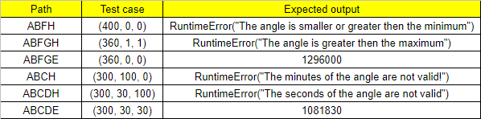

# Втора лабораториска вежба по Софтверско инженерство

## Мартин Поповски, бр. на индекс 186086

### Група на код: 

Ја добив групата на код 6

###  Control Flow Diagram

###  Control Flow Graph

### Цикломатска комплексност

Цикломатската комплексност на овој код е 7, истата ја добив преку формулата (број на ребра) - (број на темиња) + 2 т.е. 10 - 5 + 2 = 7.
Бројот на ребра и темиња се бројат само внатре во for циклусот.

### Тест случаи според критериумот Every branch 

### Тест случаи според критериумот Every path

### Објаснување на напишаните unit tests

За EveryBranch Unit тестовите ги поминуваат сине можни branch-ови помеѓу сите јазли, 
додека EveryPath ги поминува сите можни патеки од почеток до крај.
За оваа програма, во мој случај, EveryBranch и EveryPath тест случаевите
ги поминуваат истите патишта, т.е. можат истите да се искористат за двете.
За 2 од тестовите враќа резултат, додека за 4 фрла исклучок кој што треба да се тестира,
т.е. да се assert-не message-от на исклучокот.
