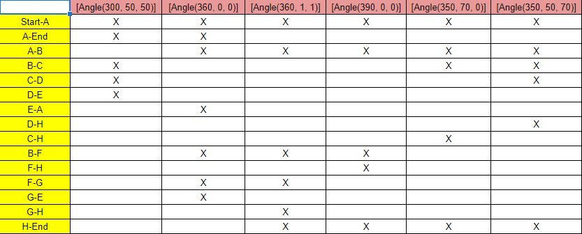

# Втора лабораториска вежба по Софтверско инженерство

## Мартин Поповски, бр. на индекс 186086

### Група на код: 

Ја добив групата на код 6

###  Control Flow Graph

### Цикломатска комплексност

Цикломатската комплексност на овој код е 7, истата ја добив преку формулата (број на ребра) - (број на темиња) + 2 т.е. 10 - 5 + 2 = 7.
Бројот на ребра и темиња се бројат само внатре во for циклусот.

### Тест случаи според критериумот Every branch 

### Тест случаи според критериумот Every path

.... 

### Објаснување на напишаните unit tests

...
...
